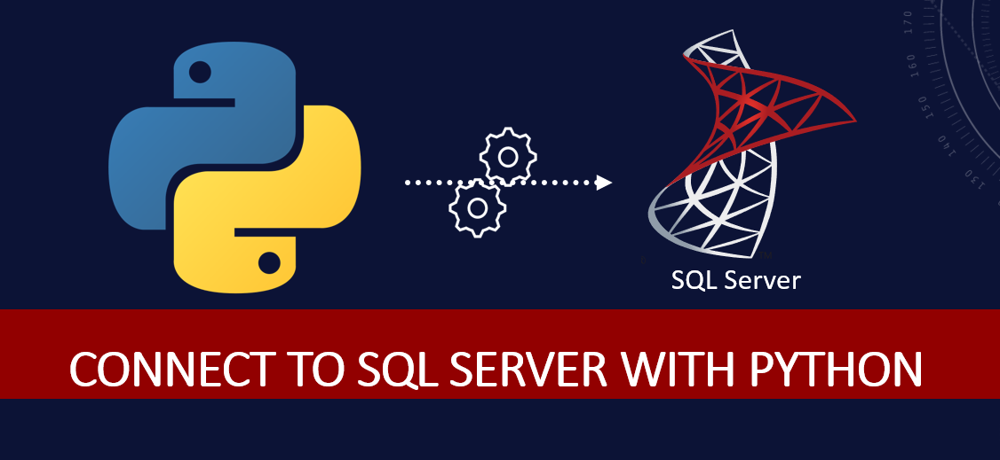

# 📊 Python SQL Connection Project

This project demonstrates how to connect Python with a relational database and perform basic to advanced SQL operations through Python scripts.

---

## 📁 Project Structure

- `connect.py` – Establishes DB connection
- `insert.py`, `update.py`, `delete.py`, `query.py` – Basic CRUD operations
- `import_author.py`, `bulk.py` – Data ingestion logic
- `transaction.py`, `procedure.py` – Advanced SQL features
- `authors.csv` – Sample dataset
- `utils.py` – Helper functions

---

## 🛠️ Technologies Used

- Python 3.x
- SQL Server
-  Pandas (optional)
- dotenv (for `.env` variables)

---
🙋‍♂️ Author
Shahryar Ahmed

GitHub: ashahryar

LinkedIn: Your LinkedIn

## 📸 Visual Overview

